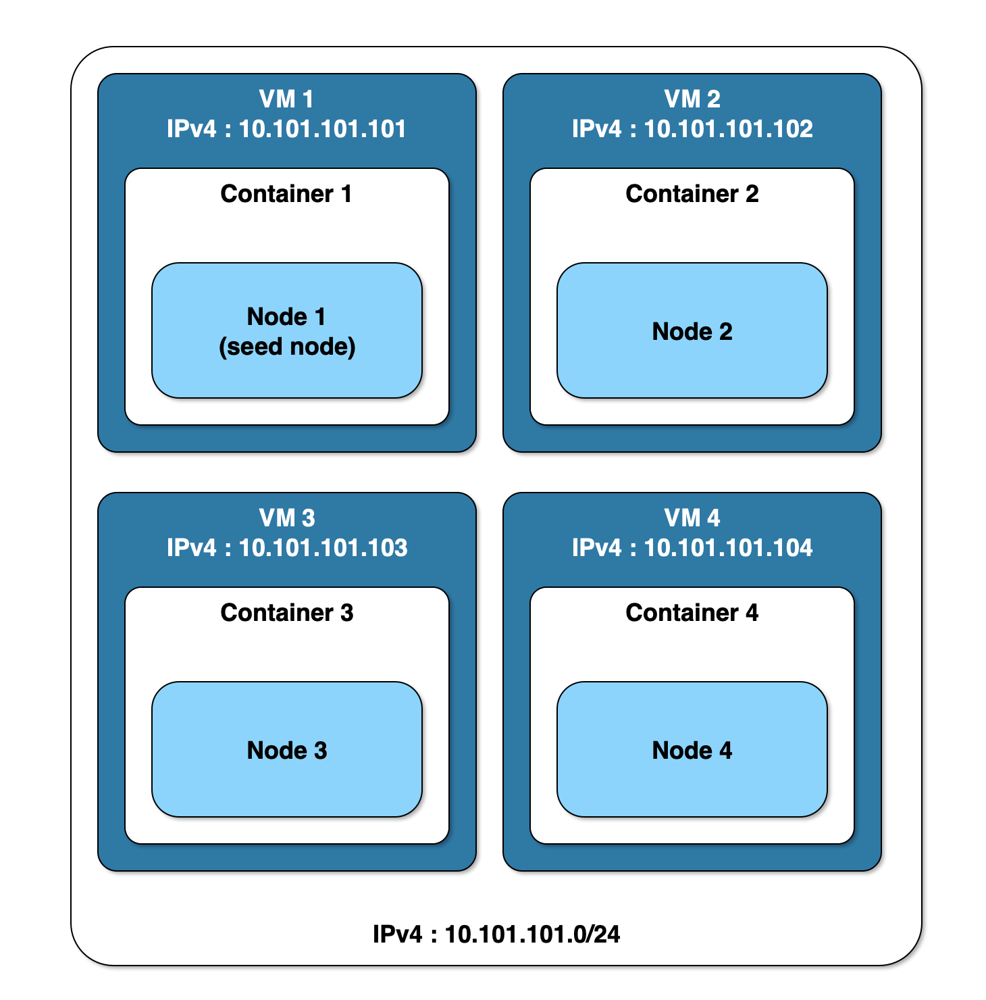

# Scenario 1.1 Cluster

A Cassandra cluster comprised of 4 nodes, with each node running in a Docker container hosted on its own VM.

## Description

* Host OS - the OS on which `vagrant` is used to provision a number of guest VMs;
* VMs - provisioned by `vagrant`, these are guests with respect to the host OS and hosts with respect to the Docker containers in which Cassandra runs;
* Docker containers - run within the VMs from a base Cassandra image plus configuration data provided during VM provisioning.

Nodes are considered to be in a single rack in a single datacentre (which is Cassandra's default configuration).

All VMs are on the same virtual host-only IPv4 network (10.101.101.0/24) and therefore mutually reachable without
additional IP routing configuration.

Relevant ports are published from each container to its host VM; because there's only one container per VM the default
ports can be used.

Cassandra nodes in the cluster are mutually reachable by configuring Cassandra to advertise its availability on the
container's host VM's IP address. This also allows Cassandra's `nodetool` and JMX clients such as `jconsole` to access
Cassandra from the guest VMs or the host OS.



## Managing the Cassandra cluster

A [Vagrantfile](Vagrantfile) is used for provisioning Parallels VMs with IDs `node_1`, `node_2`, `node_3` and `node_4`
and these can be individually controlled using `vagrant`, if desired. For instance, to bring up `node_1`:

```bash
$ vagrant up node_1
```

On creation, each VM is provisioned using the [provision](provision) script to run a Docker Container with appropriate
configuration values. Run the script without any arguments to generate a usage message on `stderr` :

```bash
$ ./provision
Usage: provision [cluster name] [node number]
```

All nodes should be provisioned with the same cluster name. `node_1` is designated the seed node for the cluster so
should be running before other nodes are brought up. The broadcast address used by Cassandra for communication with
other nodes in the cluster is generated from the node number. For example :

```bash
$ ./provision 'My Cluster' 1
[2021-09-12T13:40:28+0100]: provisioning node node_1 in cluster "My Cluster" configured with broadcast address 10.101.101.101
...
```
The cluster can be brought up, brought down or destroyed using the [cluster](cluster) script which wraps the `provision`
script and ensures that `node_1` is brought up first and taken down last. Run the script without any arguments to
generate a usage message on `stderr` :

```bash
$ ./cluster 
Usage: cluster [up|destroy|down]
```

## Cluster log and data files

Two directories on each VM host are bind-mounted into the Cassandra Docker container, one for data files and one for log
files :

* `/var/lib/cassandra` - for Cassandra data files
* `/var/log/cassandra` - for Cassandra log files

This makes it relatively straightforward to view these files by SSHing into a VM using `vagrant ssh <node_id>`.
